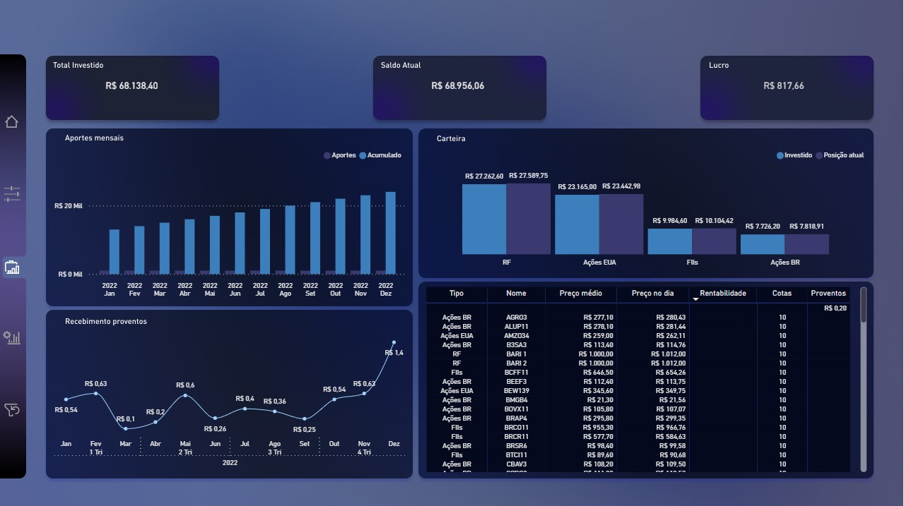
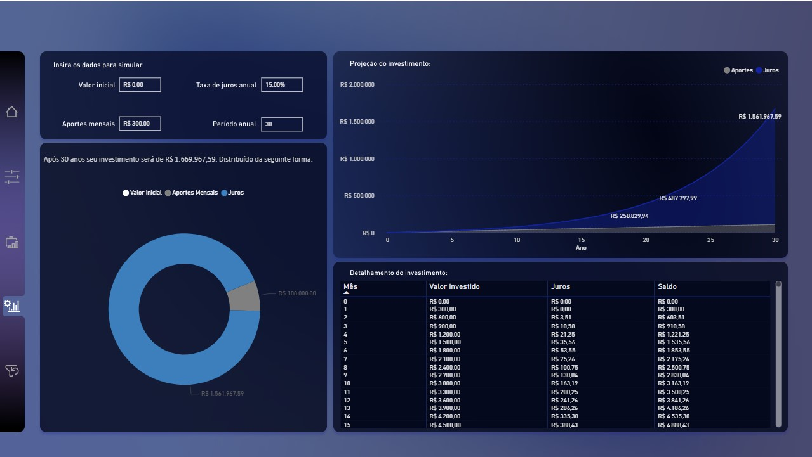

# Investimentos — Dashboard Power BI (PBIP)

Este repositório contém o projeto Power BI em formato PBIP do dashboard "Investimentos".
Ele foi organizado e documentado por um agente automatizador para facilitar versionamento,
colaboração e reprodução do ambiente.

## Como abrir o projeto

1. Instale o Power BI Desktop (recomendado versão 2023 ou superior).
2. Clone este repositório:
   - `git clone https://github.com/caiorja/Investimentos.git`
3. No Power BI Desktop, abra o arquivo PBIP localizado em:
   - `dashboards/Investimentos/Investimentos.pbip`

Se você estiver utilizando uma versão antiga do Power BI Desktop, certifique-se de
habilitar o suporte ao formato PBIP (Project) nas opções de preview, quando aplicável.

## Estrutura do repositório

- `dashboards/Investimentos/`
  - `Investimentos.pbip`: projeto Power BI do dashboard.
  - `README.md`: documentação específica do dashboard (páginas, fontes, tamanho e hash).
  - `METADATA.json`: metadados gerados automaticamente (nome, páginas, fontes, etc.).
- `report.json`: relatório de execução do agente (fonte dos arquivos e catálogo).
- `README.md` (este arquivo): guia principal de uso e manutenção.

Documentação detalhada do dashboard:
- [dashboards/Investimentos/README.md](dashboards/Investimentos/README.md)

## Visualização online

Você pode visualizar o dashboard publicado diretamente no Power BI Service:

- https://app.powerbi.com/view?r=eyJrIjoiYTA0NTA3YzktZjVlNC00MjAzLWJlYzEtZTBlODdiNjQ3N2FhIiwidCI6IjA5ZjRiZmNhLTY3Y2QtNGU0Zi05NjNkLWExYzk1MzEyNmMwNCJ9

Observação: acesso e visibilidade dependem das configurações de compartilhamento do relatório no Power BI.

## Imagens do dashboard

Imagens selecionadas (pg01 e pg02):

## Boas práticas de versionamento (PBIP)

- Arquivos de configuração local e cache do Power BI são ignorados pelo `.gitignore`,
  evitando ruído de versionamento:
  - `**/.pbi/localSettings.json`
  - `**/.pbi/cache.abf`
- Utilize mensagens de commit claras e objetivas, por exemplo:
  - `feat: adiciona nova página de análise X`
  - `fix: corrige medida DAX para Y`
  - `docs: atualiza README com instruções de uso`
- Para mudanças grandes, prefira trabalhar em branches e abrir Pull Requests.

## Atualizações e manutenção

1. Faça as alterações no Power BI Desktop, salve o projeto PBIP.
2. No Git:
   - `git add -A`
   - `git commit -m "descrição da mudança"`
   - `git push`

## Conexões e dados

Este repositório não inclui credenciais sensíveis. Ao abrir o PBIP, ajuste as
`Data Source Settings` conforme necessário. Caso haja fontes externas (arquivos,
serviços, bancos), valide caminhos e permissões no seu ambiente.

## Licença

Este projeto está licenciado sob a Licença MIT. Veja o arquivo [LICENSE](LICENSE) para detalhes.

## Autor e contato

- Autor: Caio Araujo
- GitHub: https://github.com/caiorja
- Issues: utilize a aba "Issues" do repositório para dúvidas e melhorias.

---

Este repositório foi estruturado seguindo um fluxo automatizado para PBIP, visando
facilitar a colaboração e a rastreabilidade das alterações.
